# Hi, I'm Vedant Joshi 👋

<p align="center">
  
</p>

I'm an aspiring **AI/ML Engineer** passionate about building practical solutions using data, programming, and machine learning.

I enjoy solving problems, building projects, contributing to open source, and continuously improving my skills.

---

## 🧠 About Me

- 🤖 Passionate about **Artificial Intelligence & Machine Learning**
- 🐍 Currently focusing on **Python**
- 📊 Learning **Data Analysis & Data Science**
- 🧩 Practicing **Data Structures & Algorithms**
- 🌱 Exploring **Deep Learning**
- 🌍 Interested in contributing to **Open Source**
- 🚀 Working towards building **real-world AI/ML projects**
- 💼 Goal: **🎯 Seeking opportunities to learn and contribute as an AI/ML intern**

---

# 🛠️ Tech Stack

### 👨‍💻 Programming Languages

<p align="left">
  
</p>

### 🤖 AI / Machine Learning & Data Science

<p align="left">
  
</p>

**Core Skills**
- Data Cleaning & Preprocessing
- Exploratory Data Analysis (EDA)
- Data Manipulation
- Data Visualization
- Feature Engineering
- Machine Learning
- Model Training & Evaluation
- Supervised & Unsupervised Learning

### 🧰 Tools & Development

<p align="left">
  
</p>

### 🗄️ Database

<p align="left">
  
</p>

---

# 📚 Currently Learning

```text
Machine Learning
      ↓
Deep Learning
      ↓
Advanced DSA
      ↓
Real-World AI/ML Projects
```

### 🤖 Machine Learning

Currently improving my understanding of:

- Supervised Learning
- Unsupervised Learning
- Data Preprocessing
- Feature Engineering
- Model Evaluation
- Regression
- Classification
- Clustering

### 📊 Data Analysis

Practicing:

- NumPy
- Pandas
- Matplotlib
- Seaborn
- Exploratory Data Analysis
- Data Cleaning
- Data Visualization

### 🧩 DSA

Currently practicing:

- Arrays
- Strings
- Linked Lists
- Stacks & Queues
- Trees
- Searching
- Sorting
- Algorithms
- Problem Solving

---

# 📊 My GitHub Contributions

<p align="center">
  <picture>
    <source media="(prefers-color-scheme: dark)" srcset="dist/github-snake-dark.svg">
    <source media="(prefers-color-scheme: light)" srcset="dist/github-snake.svg">
    
  </picture>
</p>

---

# 📊 GitHub Statistics

<p align="center">
  
  
</p>

---

# 🎯 Goals

> **Learn → Build → Contribute → Improve → Repeat**

- 🧠 Become a strong AI/ML Engineer
- 🚀 Build meaningful projects
- 🌍 Make useful open-source contributions
- 💼 Gain industry experience
- 🧩 Improve my DSA and problem-solving skills
- 📈 Keep improving every day

---

# 🤝 Connect With Me

📧 **Email:** [for.work.1871@gmail.com](mailto:for.work.1871@gmail.com)

💻 **GitHub:** [@jvedant1001-ship-it](https://github.com/jvedant1001-ship-it)

---
